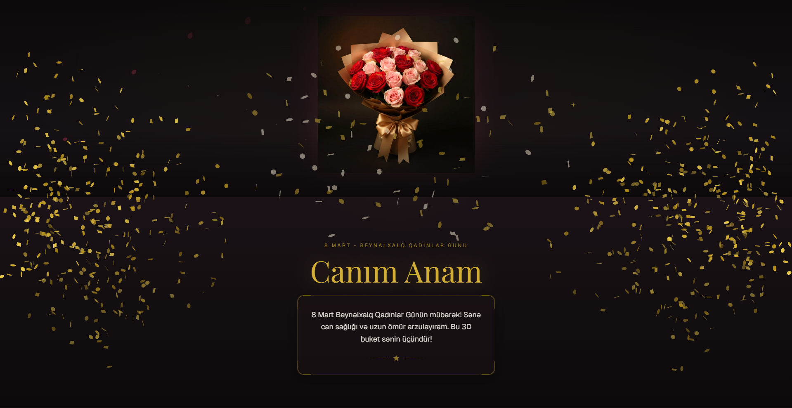

# 🌷 8 Mart - 3D İnteraktiv Təbrik Təcrübəsi

Bu layihə 8 Mart Beynəlxalq Qadınlar Günü üçün hazırlanmış, müasir veb texnologiyaları və 3D qrafikadan istifadə edən interaktiv təbrik platformasıdır. Göndərilən şəxsə özəl olaraq ad və mesajı dinamik şəkildə dəyişmək mümkündür.



## 🚀 Canlı Baxış
Layihənin canlı versiyasını buradan yoxlaya bilərsiniz: **[SƏNİN-VERCEL-LİNKİNİ-BURA-YAZ.vercel.app]**

## ✨ Əsas Özəlliklər
- **Dinamik URL Parametrləri:** URL-dəki `?id=` parametri ilə fərqli şəxslərə özəl təbriklər göstərilir.
- **3D Qrafika:** `Three.js` mühərriki ilə hazırlanmış, istifadəçinin fırlada biləcəyi 3D gül buketi.
- **Avtomatik Mərkəzləmə:** 3D modelin həndəsi kütlə mərkəzini hesablayıb avtomatik ekrana sığdıran alqoritm.
- **İnteraktiv UI:** "Framer Motion" ilə axıcı animasiyalar və zərrəcik (confetti) partlayışı.

## 🛠 İstifadə Olunan Texnologiyalar
- **Frontend:** Next.js (React), Tailwind CSS
- **3D Mühərrik:** Three.js, React Three Fiber, GLTFLoader
- **Animasiyalar:** Framer Motion, Canvas-confetti
- **Deployment:** Vercel

## ⚙️ Necə İstifadə Etməli?
Siz bu layihəni fərqli şəxslər üçün xüsusi linklərlə göndərə bilərsiniz. Kodun daxilindəki JSON bazasından istifadə edilir.

**Nümunə Linklər:**
- Ana üçün: `https://senin-linkin.vercel.app/?id=ana`
- Bacı üçün: `https://senin-linkin.vercel.app/?id=baci`
- Standart (Ümumi) təbrik: `https://senin-linkin.vercel.app/`

## 💻 Lokal Quraşdırma (Local Setup)
Bu layihəni öz kompüterinizdə işə salmaq üçün:

1. Reponu klonlayın:
   ```bash
   git clone [https://github.com/DarkSecret-eng/womens-day-3d-greeting.git](https://github.com/DarkSecret-eng/womens-day-3d-greeting.git)
   Qovluğa daxil olun və paketləri yükləyin:
2. Qovluğa daxil olun və paketləri yükləyin:
    Bash
      cd womens-day-3d-greeting
      npm install
3. Serveri başladın:
   Bash
    npm run dev
   
